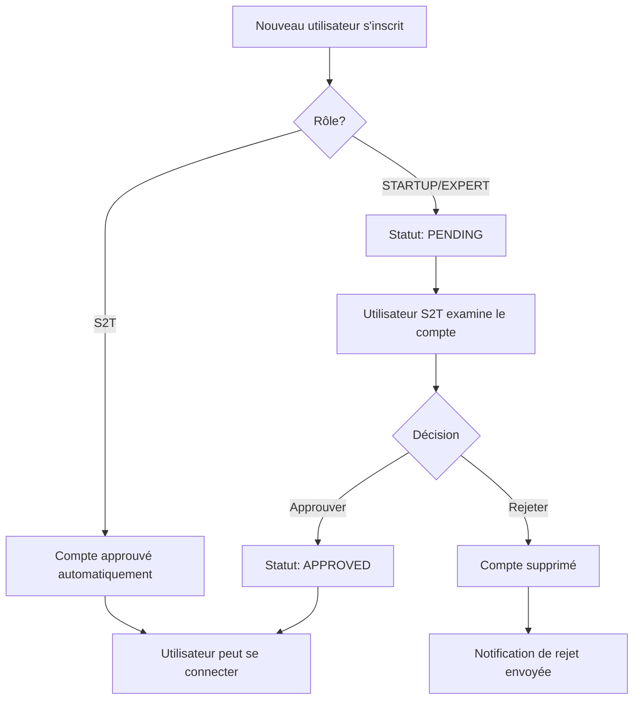

# 📚 Documentation - Système de Gestion des Utilisateurs S2T

## 🎯 Vue d'ensemble du système

Le système de gestion des utilisateurs permet aux utilisateurs ayant le rôle **S2T** de valider, approuver ou rejeter les nouveaux comptes utilisateurs avant qu'ils puissent accéder à l'application.

---

## 🔐 Règles d'Authentification et d'Autorisation

### **Rôles Utilisateur :**
- **S2T** : Super administrateur avec tous les droits de gestion
- **STARTUP** : Utilisateur startup (nécessite validation S2T)
- **EXPERT** : Utilisateur expert (nécessite validation S2T)

### **Statuts des Comptes :**
- **PENDING** : En attente de validation
- **APPROVED** : Approuvé et peut se connecter
- **REJECTED** : Rejeté définitivement

### **Règles de Connexion :**
1. ✅ Seuls les utilisateurs **APPROVED** peuvent se connecter
2. ✅ Les nouveaux comptes sont automatiquement en statut **PENDING**
3. ✅ Un utilisateur **S2T** peut se connecter immédiatement après création
4. ❌ Les comptes **PENDING** ou **REJECTED** ne peuvent pas se connecter

---

## 🛡️ Middleware de Sécurité Backend

### **Authentication Middleware (`authenticateToken`)**
```javascript
const authenticateToken = (req, res, next) => {
  const authHeader = req.headers['authorization'];
  const token = authHeader && authHeader.split(' ')[1];
  
  if (!token) {
    return res.status(401).json({ message: 'Token d\'accès requis' });
  }

  jwt.verify(token, process.env.JWT_SECRET, (err, user) => {
    if (err) return res.status(403).json({ message: 'Token invalide' });
    req.user = user;
    next();
  });
};
```

### **Authorization Middleware (`requireRole`)**
```javascript
const requireRole = (requiredRole) => {
  return (req, res, next) => {
    if (req.user.role !== requiredRole) {
      return res.status(403).json({ 
        message: 'Accès interdit - Rôle insuffisant' 
      });
    }
    next();
  };
};

const requireApprovedStatus = (req, res, next) => {
  if (req.user.status !== 'APPROVED') {
    return res.status(403).json({ 
      message: 'Compte non approuvé - Contactez un administrateur' 
    });
  }
  next();
};
```

---

## 🌐 Endpoints API Backend

### **1. Récupérer tous les utilisateurs**
```http
GET /api/users/all
Authorization: Bearer <token>
Rôle requis: S2T
```

**Réponse :**
```json
{
  "success": true,
  "data": [
    {
      "_id": "user_id",
      "firstName": "John",
      "lastName": "Doe",
      "email": "john@example.com",
      "username": "johndoe",
      "role": "STARTUP",
      "status": "PENDING",
      "createdAt": "2025-01-01T10:00:00Z",
      "lastLogin": null,
      "blocked": false,
      "avatar": "profile.jpg"
    }
  ],
  "total": 150
}
```

### **2. Récupérer les utilisateurs en attente**
```http
GET /api/users/pending
Authorization: Bearer <token>
Rôle requis: S2T
```

### **3. Approuver un utilisateur**
```http
PUT /api/users/:userId/approve
Authorization: Bearer <token>
Rôle requis: S2T
```

**Réponse :**
```json
{
  "success": true,
  "message": "Utilisateur approuvé avec succès",
  "data": {
    "_id": "user_id",
    "status": "APPROVED",
    "approvedBy": "s2t_user_id",
    "approvedAt": "2025-01-01T10:00:00Z"
  }
}
```

### **4. Rejeter/Supprimer un utilisateur**
```http
DELETE /api/users/:userId
Authorization: Bearer <token>
Rôle requis: S2T

Body:
{
  "reason": "Profil incomplet ou non conforme"
}
```

### **5. Mettre à jour le statut**
```http
PUT /api/users/:userId/status
Authorization: Bearer <token>
Rôle requis: S2T

Body:
{
  "status": "APPROVED" | "PENDING" | "REJECTED"
}
```

### **6. Bloquer/Débloquer un utilisateur**
```http
PUT /api/users/:userId/block
Authorization: Bearer <token>
Rôle requis: S2T

Body:
{
  "blocked": true | false
}
```

### **7. Statistiques des utilisateurs**
```http
GET /api/users/stats
Authorization: Bearer <token>
Rôle requis: S2T
```

**Réponse :**
```json
{
  "success": true,
  "data": {
    "total": 150,
    "pending": 25,
    "approved": 120,
    "rejected": 5,
    "byRole": {
      "STARTUP": 80,
      "EXPERT": 65,
      "S2T": 5
    }
  }
}
```

### **8. Rechercher des utilisateurs**
```http
GET /api/users/search?role=STARTUP&status=PENDING&email=john
Authorization: Bearer <token>
Rôle requis: S2T
```

### **9. Envoyer une notification**
```http
POST /api/users/notify
Authorization: Bearer <token>
Rôle requis: S2T

Body:
{
  "userId": "user_id",
  "type": "APPROVED" | "REJECTED",
  "message": "Message personnalisé"
}
```

---

## 🔧 Implémentation Backend (Contrôleur)

### **Structure du Contrôleur Utilisateur**
```javascript
// controllers/userManagementController.js
const User = require('../models/User');
const jwt = require('jsonwebtoken');
const bcrypt = require('bcryptjs');

class UserManagementController {
  
  // Récupérer tous les utilisateurs (S2T uniquement)
  async getAllUsers(req, res) {
    try {
      const users = await User.find({})
        .select('-password')
        .sort({ createdAt: -1 });
      
      res.json({
        success: true,
        data: users,
        total: users.length
      });
    } catch (error) {
      res.status(500).json({
        success: false,
        message: 'Erreur serveur',
        error: error.message
      });
    }
  }

  // Approuver un utilisateur
  async approveUser(req, res) {
    try {
      const { userId } = req.params;
      const user = await User.findByIdAndUpdate(
        userId,
        {
          status: 'APPROVED',
          approvedBy: req.user.id,
          approvedAt: new Date()
        },
        { new: true }
      ).select('-password');

      if (!user) {
        return res.status(404).json({
          success: false,
          message: 'Utilisateur non trouvé'
        });
      }

      res.json({
        success: true,
        message: 'Utilisateur approuvé avec succès',
        data: user
      });
    } catch (error) {
      res.status(500).json({
        success: false,
        message: 'Erreur lors de l\'approbation',
        error: error.message
      });
    }
  }

  // Supprimer un utilisateur
  async deleteUser(req, res) {
    try {
      const { userId } = req.params;
      const { reason } = req.body;

      // Ne pas permettre la suppression d'autres utilisateurs S2T
      const targetUser = await User.findById(userId);
      if (targetUser.role === 'S2T') {
        return res.status(403).json({
          success: false,
          message: 'Impossible de supprimer un utilisateur S2T'
        });
      }

      await User.findByIdAndDelete(userId);

      // Log de l'action
      console.log(`Utilisateur supprimé par ${req.user.id}: ${userId}, Raison: ${reason}`);

      res.json({
        success: true,
        message: 'Utilisateur supprimé avec succès'
      });
    } catch (error) {
      res.status(500).json({
        success: false,
        message: 'Erreur lors de la suppression',
        error: error.message
      });
    }
  }
}

module.exports = new UserManagementController();
```

---

## 🚨 Règles de Sécurité Frontend

### **Protection des Routes**
```typescript
// Vérification du rôle S2T au niveau du composant
useEffect(() => {
  if (!user || user.role !== 'S2T') {
    navigate('/unauthorized', { replace: true });
    return;
  }
}, [user, navigate]);
```

### **Gestion des Tokens**
```javascript
// Intercepteur pour les requêtes API
const makeRequest = async (url, options = {}) => {
  const token = localStorage.getItem('token');
  
  const defaultOptions = {
    headers: {
      'Content-Type': 'application/json',
      ...(token && { 'Authorization': `Bearer ${token}` })
    },
    ...options
  };

  try {
    const response = await fetch(`${API_BASE_URL}${url}`, defaultOptions);
    
    if (response.status === 401) {
      // Token expiré ou invalide
      localStorage.removeItem('token');
      window.location.href = '/login';
      return;
    }

    if (!response.ok) {
      const errorData = await response.json().catch(() => ({}));
      throw new Error(errorData.message || `Erreur HTTP: ${response.status}`);
    }

    return await response.json();
  } catch (error) {
    console.error('Erreur API:', error);
    throw error;
  }
};
```

---

## 📊 Flux de Validation des Comptes



---

## 🎨 Interface Utilisateur

### **Couleurs et Badges**
- 🟢 **Approuvé** : `badge-success` (vert)
- 🟡 **En attente** : `badge-warning` (jaune)
- 🔴 **Rejeté** : `badge-danger` (rouge)
- 🔵 **S2T** : `badge-primary` (bleu)
- 🟣 **Startup** : `badge-info` (cyan)
- ⚫ **Expert** : `badge-secondary` (gris)

### **Actions Disponibles**
1. **Pour les comptes PENDING :**
   - ✅ Bouton d'approbation (vert)
   - ❌ Bouton de rejet (rouge)

2. **Pour les comptes APPROVED :**
   - 🔒 Bouton de blocage/déblocage (jaune/vert)
   - 🗑️ Bouton de suppression (rouge)

3. **Restrictions :**
   - Les utilisateurs S2T ne peuvent pas être supprimés
   - Seuls les rôles STARTUP et EXPERT peuvent être gérés

---

## 🛠️ Installation et Configuration

### **Variables d'Environnement Required**
```env
# Backend
JWT_SECRET=your_jwt_secret_key
JWT_EXPIRES_IN=24h
MONGODB_URI=mongodb://localhost:27017/synergypark
EMAIL_SERVICE_API_KEY=your_email_api_key

# Frontend
REACT_APP_API_URL=http://localhost:5000
```

### **Permissions Recommandées**
1. Seuls les super-administrateurs peuvent créer des comptes S2T
2. Mise en place de logs d'audit pour toutes les actions S2T
3. Notifications email automatiques lors d'approbation/rejet
4. Sauvegarde des données avant suppression définitive

---

Cette documentation couvre l'ensemble du système de gestion des utilisateurs avec toutes les règles de sécurité et d'authentification nécessaires.